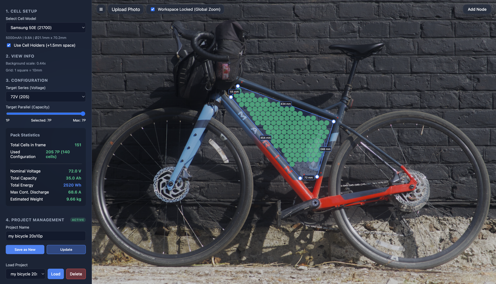

# 🔋 E-Bike Battery Designer


A complete web-based tool for designing custom E-Bike battery packs. This application allows you to visually plan the layout of battery cells within custom geometric shapes (like a bicycle frame triangle), calculating optimal placement using a honeycomb cell packing algorithm.

## ✨ Features

- **Interactive Millimeter Grid**: 1:1 scale mapping using a fixed coordinate system.
- **"Photoshop-Style" Workspace**: Upload a photo of your bike/frame, scale it to match real-world millimeter dimensions, and lock it in place.
- **Global Camera Pan & Zoom**: Navigate your workspace and inspect tight corners effortlessly.
- **Honeycomb Cell Packing Algorithm**: Automatically calculates the absolute maximum number of cells that can physically fit inside your drawn polygon, with optional +1.5mm spacing for cell holders.
- **Real-Time Pack Statistics**: Dynamically calculates Total Capacity (Ah), Nominal Voltage (V), Total Energy (Wh), Maximum Continuous Discharge (A), and Estimated Weight (kg).
- **Project Management System**: Save, name, update, delete, and load your custom battery configurations instantly from the database.

## 🛠️ Technology Stack

This is a modern monorepo application divided into a frontend and a backend.

- **Frontend**: React, TypeScript, Vite, Vanilla CSS (Glassmorphism aesthetic).
- **Backend**: NestJS, TypeScript, TypeORM, SQLite (Zero-config local database).

## 🚀 Getting Started

### Prerequisites
- [Node.js](https://nodejs.org/) (v18 or newer recommended)
- npm or yarn

### 1. Start the Backend

The backend uses a local SQLite database (`battery-designer.sqlite`), so there is no database setup required. It will automatically initialize tables and seed the top 10 most popular 18650/21700 cells on the first run.

```bash
cd backend
npm install
npm run start:dev
```
*The backend will be available on http://localhost:3000.*

### 2. Start the Frontend

In a new terminal window:

```bash
cd frontend
npm install
npm run dev
```
*The frontend will dynamically render on http://localhost:5174 (or 5173).*

## 💡 How to use

1. **Select Cell Type**: Pick your desired battery cell model from the sidebar (e.g., Samsung 50E 21700).
2. **Setup Voltage/Capacity**: Choose the required Voltage (e.g., 20S / 72V) and parallel configuration.
3. **Upload Photo**: Click **Upload Photo** and drop in a picture of your bike frame.
4. **Calibrate Dimensions**: Measure a tube on your real bike. Using the red dimension labels on the polygon edges, stretch the polygon so it mimics that real-world measurement. Then, pan and zoom your photo to perfectly align with that line.
5. **Lock Workspace**: Check the **Workspace Locked** button to lock the photo to the millimeter grid. You can now use the mouse wheel to zoom the entire scene globally.
6. **Draw**: Drag the white nodes to trace the inner bounds of your frame triangle. The algorithm will automatically pack the maximum amount of cells.
7. **Save**: Give it a name and hit **Save as New** to store it in your local database!

## 📝 License

This project is licensed under the MIT License.
